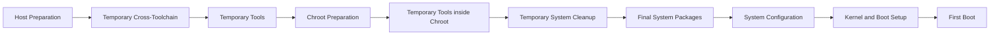

# LFS Build Flow Chart

This document provides a high-level visual overview of the Linux From Scratch 13.0-systemd build process.

The goal is to show the main build sequence clearly without making the diagram too long or difficult to read. Detailed package notes are documented separately in the chapter files under the `docs/` directory.

## Main Build Flow

## Stage Details

### 1. Host Preparation

This stage prepares the host environment used to build LFS.

Main tasks:

* Prepare the Debian host system inside VirtualBox.
* Check host system requirements.
* Create and mount the LFS partition.
* Set the `LFS=/mnt/lfs` environment variable.
* Create the sources directory.
* Download the required packages and patches.

### 2. Temporary Cross-Toolchain

This stage builds the first isolated toolchain used to build the temporary system.

Main components:

* Binutils Pass 1
* GCC Pass 1
* Linux API Headers
* Glibc temporary build
* Libstdc++ temporary build

### 3. Temporary Tools

This stage builds temporary tools that are required before entering the chroot environment.

Examples:

* M4
* Ncurses
* Bash
* Coreutils
* Diffutils
* File
* Findutils
* Gawk
* Grep
* Gzip
* Make
* Patch
* Sed
* Tar
* Xz
* Binutils Pass 2
* GCC Pass 2

### 4. Chroot Preparation

This stage prepares the LFS environment so it can be entered as an isolated root filesystem.

Main tasks:

* Change ownership of the LFS filesystem to `root`.
* Mount virtual filesystems such as `/dev`, `/proc`, `/sys`, and `/run`.
* Enter the chroot environment.
* Create the basic directory structure.
* Create `/etc/passwd` and `/etc/group`.
* Create initial log files and the `tester` user.

### 5. Temporary Tools inside Chroot

This stage builds additional temporary tools from inside the chroot environment.

Main packages:

* Gettext
* Bison
* Perl
* Python
* Texinfo
* Util-linux

### 6. Temporary System Cleanup

This stage removes temporary files and prepares the environment for building the final system.

Main tasks:

* Remove temporary documentation files.
* Remove unnecessary `.la` files.
* Remove the `/tools` directory.
* Prepare for final Chapter 8 package builds.

### 7. Final System Packages

This is the main final build stage where the real LFS system packages are built.

Examples:

* Man-pages
* Iana-Etc
* Glibc
* Zlib
* Bzip2
* Xz
* Zstd
* Readline
* Ncurses
* Attr
* Acl
* Libcap
* Libxcrypt
* Shadow
* GCC
* Binutils
* Coreutils
* Bash
* Systemd

### 8. System Configuration

This stage configures the final LFS system.

Main tasks:

* Configure networking.
* Configure locale settings.
* Configure console and keyboard settings.
* Configure the time zone.
* Configure systemd services.
* Create `/etc/fstab`.

### 9. Kernel and Boot Setup

This stage prepares the system for booting independently.

Main tasks:

* Build the Linux kernel.
* Install kernel modules.
* Configure the bootloader.
* Perform final cleanup.
* Reboot into the completed LFS system.

## Current Progress Marker

The current build progress is in Chapter 8, during the final system package build stage.

The temporary cross-toolchain, temporary tools, chroot preparation, and temporary tools inside chroot stages have already been completed.

