# LFS Build Flow Chart

This document provides a structured overview of the Linux From Scratch 13.0-systemd build process.

The goal of this chart is to explain the main build stages and how they connect together, from preparing the host system to booting into the final LFS system.

It does not replace the official LFS book. The official book remains the primary reference for exact commands, package versions, and build instructions.

## Detailed Build Flow

```mermaid
flowchart TD

    A[Start<br/>LFS 13.0-systemd Build] --> B[Host System Preparation]

    subgraph S1[Stage 1: Host Preparation]
        B --> B1[Prepare Debian Host<br/>VirtualBox environment]
        B1 --> B2[Check Host Requirements<br/>Required tools and versions]
        B2 --> B3[Create LFS Partition<br/>Format and mount target partition]
        B3 --> B4[Set LFS Variable<br/>LFS=/mnt/lfs]
        B4 --> B5[Create Sources Directory<br/>/mnt/lfs/sources]
        B5 --> B6[Download Packages and Patches]
    end

    B6 --> C[Temporary Toolchain]

    subgraph S2[Stage 2: Temporary Cross-Toolchain]
        C --> C1[Binutils Pass 1<br/>Build initial assembler and linker]
        C1 --> C2[GCC Pass 1<br/>Build initial cross-compiler]
        C2 --> C3[Linux API Headers<br/>Install kernel headers]
        C3 --> C4[Glibc Temporary Build<br/>Install temporary C library]
        C4 --> C5[Libstdc++ Temporary Build<br/>C++ runtime for temporary compiler]
    end

    C5 --> D[Temporary Tools]

    subgraph S3[Stage 3: Temporary Tools]
        D --> D1[Build Essential Temporary Tools<br/>M4, Ncurses, Bash, Coreutils]
        D1 --> D2[Build File and Text Tools<br/>Diffutils, File, Findutils, Gawk, Grep]
        D2 --> D3[Build Archive and Build Tools<br/>Gzip, Make, Patch, Sed, Tar, Xz]
        D3 --> D4[Binutils Pass 2<br/>Improve temporary linker and tools]
        D4 --> D5[GCC Pass 2<br/>Build improved temporary compiler]
    end

    D5 --> E[Enter Chroot Preparation]

    subgraph S4[Stage 4: Chroot Preparation]
        E --> E1[Change Ownership<br/>Assign LFS files to root]
        E1 --> E2[Mount Virtual Filesystems<br/>/dev, /proc, /sys, /run]
        E2 --> E3[Enter Chroot<br/>Use /mnt/lfs as root directory]
        E3 --> E4[Create Directory Structure<br/>/etc, /usr, /var, /bin, /lib]
        E4 --> E5[Create Basic System Files<br/>/etc/passwd and /etc/group]
        E5 --> E6[Create Logs and Tester User]
    end

    E6 --> F[Temporary Tools inside Chroot]

    subgraph S5[Stage 5: Temporary Tools inside Chroot]
        F --> F1[Build Gettext]
        F1 --> F2[Build Bison]
        F2 --> F3[Build Perl]
        F3 --> F4[Build Python]
        F4 --> F5[Build Texinfo]
        F5 --> F6[Build Util-linux]
        F6 --> F7[Clean Temporary System<br/>Remove temporary files and /tools]
    end

    F7 --> G[Final System Build]

    subgraph S6[Stage 6: Final System Packages]
        G --> G1[Install Documentation and Base Data<br/>Man-pages and Iana-Etc]
        G1 --> G2[Build Final C Library<br/>Glibc]
        G2 --> G3[Build Compression Libraries<br/>Zlib, Bzip2, Xz, Zstd]
        G3 --> G4[Build Core Libraries<br/>Readline, Ncurses, Libcap, Acl, Attr]
        G4 --> G5[Build Security and User Tools<br/>Libxcrypt, Shadow]
        G5 --> G6[Build Final Compiler Toolchain<br/>GCC, Binutils and related tools]
        G6 --> G7[Build Core System Utilities<br/>Coreutils, Bash, Grep, Sed, Gawk, Findutils]
        G7 --> G8[Build Package and Build Utilities<br/>Make, Patch, Tar, Diffutils, File]
        G8 --> G9[Build System Services and Runtime Tools<br/>Systemd and related packages]
    end

    G9 --> H[System Configuration]

    subgraph S7[Stage 7: System Configuration]
        H --> H1[Configure Network Files]
        H1 --> H2[Configure System Locale]
        H2 --> H3[Configure Input and Console]
        H3 --> H4[Configure Time Zone]
        H4 --> H5[Configure Systemd Services]
        H5 --> H6[Create /etc/fstab]
    end

    H6 --> I[Kernel and Boot Setup]

    subgraph S8[Stage 8: Kernel and Boot]
        I --> I1[Build Linux Kernel]
        I1 --> I2[Install Kernel Modules]
        I2 --> I3[Configure Bootloader]
        I3 --> I4[Final Cleanup]
        I4 --> I5[Reboot into LFS]
    end

    I5 --> J[Completed LFS System]
```

## Notes

* The chart is intentionally organized by build stages rather than listing every package individually.
* The most critical transition points are:

  * Building the temporary cross-toolchain.
  * Entering the chroot environment.
  * Removing temporary tools.
  * Building the final system packages.
  * Configuring the kernel and bootloader.
* Detailed package notes should remain in the chapter documentation files under the `docs/` directory.
* The current build progress is in Chapter 8, during the final system package build stage.

## Current Progress Marker

At the current stage, the build has already passed the temporary toolchain and chroot preparation phases. Work is now focused on final system packages in Chapter 8.

