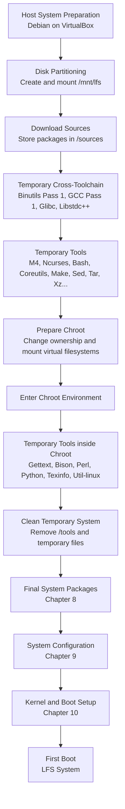

# مخطط مراحل بناء LFS

هذا المخطط يوضح المسار العام لبناء نظام Linux From Scratch 13.0-systemd، من تجهيز النظام المضيف حتى الوصول إلى النظام النهائي القابل للإقلاع.

الهدف من المخطط هو إعطاء صورة ذهنية واضحة لتسلسل البناء، وليس استبدال خطوات الكتاب الرسمية أو شرح كل حزمة بالتفصيل.

## ملاحظات على المخطط

* هذا المخطط يوضح الصورة العامة لمراحل بناء LFS.
* تفاصيل كل مرحلة موثقة في ملفات الفصول داخل مجلد `docs/`.
* المرحلة الحالية من المشروع تقع ضمن بناء حزم النظام النهائي في Chapter 8.
* تم استخدام اللغة الإنجليزية داخل المخطط لأن Mermaid يتعامل معها بشكل أوضح من النص العربي المختلط.

